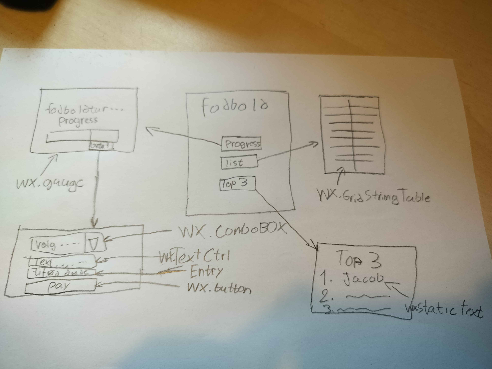
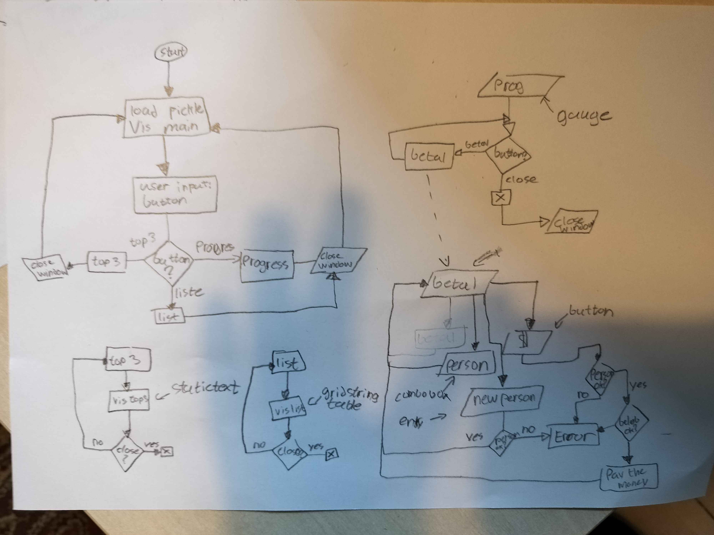

# fodboldtur-baby
yeah so programmer skillz uhhu soooo here is my amazing flowcharts of ze uhhhuhhuh uhuhu :)

jeg er så god til readme:
(stiplet linjer = nyt stuff som jeg har tilføjet, yipee)

Her har vi min dejlige userinterface sketch (jeg er en kunstner ik)

Live jacob reaktion til denne dejlige sketch (han ser så entusiastisk ud :) )

og her er min flowchart ting af userinputs

### lille note fra tawfik
sååå jeg har måske ikke lige kigget på hvordan jeg kunne "guide" brugere, og jeg magter ikke at lave om på mit flowchart (den er allerede propfyldt med ting), sååå det bliver et problem til næste gang :)

## KILDER
https://www.geeksforgeeks.org/python/python-gui-tkinter/
